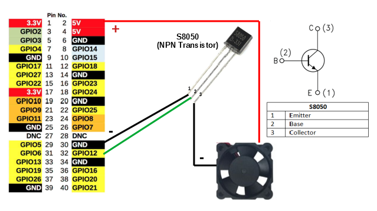

# Raspberry PI GPIO Fan Control



```
Usage of ./rpi-fan-control:
  -pin int
    	GPIO pin for fan control (default 16)
  -source string
    	Path to file of temperature source (default "/sys/class/thermal/thermal_zone0/temp")
  -start float
    	Temperature to start fan at Celsius temp (default 70)
  -stop float
    	Temperature to stop fan at Celsius temp (default 60)
```
Example

```
./rpi-fan-control -pin=16 -start=50 -stop=35
```


